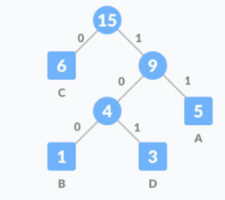

# Optimal alphabet encoding


## Overview
This paper is the result of several months of work and research conducted for the purpose of completing the course Alati i metode softverskog inzenjerstva i vestacke inteligencije in the master's studies at the Faculty of Organizational Sciences, in the Software Engineering study program.


During the course, I became interested in algorithms and data structures, exploring when to use each one, as well as their performance and data structure organization. In this project, I will present a solution to a problem characteristic of the computer science domain: optimal alphabet coding. I have solved this problem using evolutionary algorithms of artificial intelligence, specifically using a genetic algorithm. This document contains a description of the problem, a brief overview of the algorithms and methodologies used, an outline of the implementation development process, challenges encountered during the work, as well as a review of the solution and a comparison with alternative approaches to solving this problem. Emphasizing the significance of algorithm complexity, I have implemented an approach to solving this problem using a "brute force" method. The solutions are implemented using the Clojure programming language, a dialect of Lisp and belonging to the class of functional programming languages. I encountered this technology during my master's studies.

## Problem description

The problem of optimal alphabet coding involves finding the most efficient way to encode a given alpabet(array of characters), tipically with the goal of minimizing the total length of the encoded message. This is particulary important in field such as data compression, where reducing the size of memory or stored data is crucial.

In this context, the problem entails determining the optimal mapping between symbols in the alphabet and their corresponding binary representations. This mapping should ideally proritize frequently occurring symbols with shorter codes, while ensuring that the codes for diiferent symbols are uniquely decodable.
*We are given an alpabet of ***N*** characters and the probabilities **$`p_i`$** that a randomly chosen character is character i. Let **$`l_i`$** is length of the encoding of character i. The objective is to minimize the expected length of message
```math
 \sum_{i=1}^{N} (p_i \cdot l_i) 
```
One of the typical ways to solve this problem is using dynamic programming and optimal tree search. Early algorithms, dating back to the 1960s, utilized optimal tree search techniques, with complexities of *O($`n^3`$)* and *O($`n^2`$)*. The most well-known algorithm addressing this problem is **Huffman coding**, which has a complexity of *O(nlogn)*
<div style="display: flex;">
  <div style="flex: 1;">
   
|Character|Frequency|Code |
|---------|---------|-----| 
|    A    |    5    |  11 |
|    B    |    1    | 100 |                                 
|    C    |    6    |  0  |
|    D    |    3    | 101 |

   
  </div>
</div>

## Evolutionary algorithm

Evolutionary algorithms are inspired by the process of natural selection and evolution observed in biological systems.

Evolution is an unusual and chaotic system that generates variations in life forms, some of which are better adapted to specific environments. According to the theory of evolution, a population exhibits the following characteristics: 
- *diversity* – individuals within the population have different genetic traits 
- *heredity* – offspring inherit genetic characteristics from their parents
- *selection* – a mechanism that measures the adaptability of an individual, with stronger individuals having a higher probability of survival; 
- *reproduction* – two individuals in the population reproduce to create offspring
- *crossover and offspring* – offspring produced through reproduction contain a combination of genes from their parents and undergo minor random changes in the genetic code

Knowledge from biological evolution has been leveraged to find optimal solutions to practical problems by generating various solutions and approaching those with better performance over many generations.

Evolutionary algorithms are powerful in solving optimization problems where the solution consists of a large number of permutations or choices. For these problems, there are usually many valid solutions, only some of which are optimal.

## Genetic algorithm

Genetic algorithm is specific algorithm from family of evolutionary algorithms. 
The genetic algorithm is utilized to explore vast search spaces in pursuit of good solutions. It does not guarantee finding the best solution but rather attempts to find the best global solution while avoiding local solutions. The life cycle of a genetic algorithm will be illustrated through an example of solving the optimal alphabet coding problem.
### Creating population
We will take, for example, the following sequence as the input parameter into the algorithm
<p align="center"><font size="8">ABBCAADBABBEE</font></p>

Now, a table is created containing all distinct characters along with their occurrences in the sequence or text.

|Character|Frequency|
|---------|---------|
|    A    |    4    |
|    B    |    5    |
|    C    |    1    |
|    D    |    1    |
|    E    |    2    |

In a genetic algorithm, it is crucial to properly encode the solution space, which requires careful design of possible states. A ***state*** is a data structure with specific rules and can contain a solution to the problem. In line with genetic algorithms and terminology in evolutionary theory, a state is called an ***individual***. A ***population*** consists of multiple individuals. Each individual contains a set of characteristics, referred to as a ***chromosome***. The chromosome contains multiple ***genes***, with one gene describing one characteristic of the individual. In this case, one gene represents the way in which a specific letter will be encoded, i.e., the number of bits that will comprise that code. Here's an example of a chromosome (individual)


| 1 | 3 | 2 | 1 | 4 | 
|---|---|---|---|---|

| 2 | 2 | 2 | 4 | 4 |
|---|---|---|---|---|

> [!NOTE]
> Each chromosome is of length L, where L equals the number of distinct characters. Each gene represents a random number from 1 to N, where N represents the number of bits needed to describe each gene. For example, if we have 5 distinct letters, each letter can be represented by combinations of a binary code with 3 digits, for instance: 000, 001, 010, etc. This way, it's possible to find a solution that requires less memory.

```clojure
(create-initial-population-optimised population-size chromosome-length)
```

### Defining the fitness function


The ***fitness function*** represents a measure of how good a solution is. In this example, the fitness function is obtained by summing the products of the character frequencies and the number of bits used for encoding.
```math
 f(x)=min\sum_{i=1}^{L} (p_i \cdot c_i)
```
where *L* is the number of characters, **$`p_i`$** is the frequency of character i and **$`c_i`$** is the number of bits used to encode character i.


However, there is a constraint to consider when calculating the fitness function. During the computation of the fitness function, we need to consider the number of distinct genes. For example, if a gene has a value of 1, it means that the character is encoded with a single binary digit, 0 or 1. Due to this characteristic of binary encoding, one chromosome cannot have more than 2 genes with a value of 1. From this property of binary encoding, we can derive a constraint for the fitness function
```math
\text{count}(g) \leq 2^{g} 
```
where **g** is value og single gene.
If the constraint is not met, the chromosome is considered invalid, and the individual is discarded from the population
```clojure
(survival population letters)
```

### Parent Selection

The next step in the genetic algorithm is the selection of parents who will create new individuals. In Darwinian theory, individuals that are more fit are more likely to produce offspring because they live longer. In the context of genetic algorithms, individuals with better fitness functions have a higher chance of participating in reproduction. In the following text, three methods of parent selection will be described.
#### Roulette wheel selection

Chromosomes are assigned a certain portion of the roulette wheel. Chromosomes with better fitness functions will have a larger portion of the wheel, and therefore a higher chance of being selected when the wheel is spun. Chromosomes with poorer fitness functions will have a lower probability of being chosen. For each individual, the probability is calculated based on its fitness function and the fitness function of the entire population. Then, the size of the resulting portion of the roulette wheel is calculated based on cumulative probabilities.

```clojure
(roulette-wheel-selection-optimised num-of-selection population letters)
```
#### Elitist selection

The elitist selection theory in genetic algorithms involves preserving the best individuals (those with the highest fitness) from one generation to the next. These top-perfoming individuals are directly took part into reproducing next generation
```clojure
(ranking-selection num-of-selection population)
```
#### Tournament selection

In tournament selection, individuals compete against each other. A randomly selected number of individuals is chosen from the population. The randomly selected individuals are then grouped, and the winners of each group will participate in further reproduction.
```clojure
(tournament-selection (select-n-individual-optimised population num-of-selection) letters k)
```
### Reproduction

Reproduction is the process by which selected individuals from the population are used to create new offspring for the next generation. In genetic algorithms, reproduction involves combining genetic material from the selected parents to create new solutions. This process typically includes crossover and mutation.
#### Two point crossover

Randomly selecting two points in the chromosome structure, and then, depending on how the parent sequences are exchanged, a children individual is created. The descendant consists of the first part of the first parent, the second part of the second parent, and the third part of the first parent.

| $${\color{red}1}$$ | $${\color{red}3}$$ | $${\color{red}2}$$ | $${\color{red}1}$$ | $${\color{red}4}$$ | 
|---|---|---|---|---|

| $${\color{blue}2}$$ | $${\color{blue}2}$$ | $${\color{blue}2}$$ | $${\color{blue}4}$$ | $${\color{blue}4}$$ |
|---|---|---|---|---|

----------------------------------------------

| $${\color{red}1}$$ | $${\color{blue}2}$$ | $${\color{blue}2}$$ | $${\color{red}1}$$ | $${\color{red}4}$$ | 
|---|---|---|---|---|

| $${\color{blue}2}$$ | $${\color{red}3}$$ | $${\color{red}2}$$ | $${\color{blue}4}$$ | $${\color{blue}4}$$ |
|---|---|---|---|---|

#### Two point mutation

Mutation involves rotating 2 genes (randomly selected) in one chromosome.

| $${\color{red}1}$$ | $${\color{green}3}$$ | $${\color{red}2}$$ | $${\color{green}1}$$ | $${\color{red}4}$$ | 
|---|---|---|---|---|

---------------------------------------

| $${\color{red}1}$$ | $${\color{green}1}$$ | $${\color{red}2}$$ | $${\color{green}3}$$ | $${\color{red}4}$$ | 
|---|---|---|---|---|

### Filling the next generation
In the next generation, the offspring that survived and the rest of the population enter. This way, the size of the population increases from generation to generation, increasing diversity and the chance of reaching the globally optimal solution.
```clojure
(tournament-new-generation population letters mutation-rate num-of-selection k)
```

## Testing and perfomance measurement
For testing the program, the Clojure library *Midje* was used. For measuring the performance of the software functionality, the *Criterium* library was used.
The performance measurement was conducted on a machine with the following specifications:

| Component       | Specification             |
|-----------------|---------------------------|
| Processor       | Intel Core i5- 13th 1335u |
| RAM             | 16 GB DDR4                |
| OS              | Windows 10                |

## Algorithms testing

In this section, the performance of the ***genetic algorithm*** will be presented. To draw conclusions from this study, the genetic algorithm will be compared with the ***brute force algorithm***.

Input string: ```ARTIFICIALINTELLIGENCE```

Table with characters and their frequences:

| A | C | E | F | G | I | L | N | R | T |
|---|---|---|---|---|---|---|---|---|---|
| 2 | 2 | 3 | 1 | 1 | 5 | 3 | 2 | 1 | 2 |

### Brute force
```clojure
(brute-force-algorithm letters)
```
**Result:**
```
*Memory*: 47 bytes

*Code*: 7 6 3 9 8 1 0 5 4 2
```
**Measurement**
```
Evaluation count : 6 in 6 samples of 1 calls.
             Execution time mean : 7,420299 sec
    Execution time std-deviation : 148,296756 ms
   Execution time lower quantile : 7,268530 sec ( 2,5%)
   Execution time upper quantile : 7,629807 sec (97,5%)
                   Overhead used : 5,610601 ns
```
|  A  |  C  | E  |  F   |  G   | I | L |  N  |  R  | T  |
|-----|-----|----|------|------|---|---|-----|-----|----|
| 111 | 110 | 11 | 1001 | 1000 | 1 | 0 | 101 | 100 | 10 |

### Genetic algorithm
```clojure
(genetic-algorithm-optimised 1000 1000 100 10 0.2 letters)
```
**Result**
```
*Memory* 41 bytes

*Code* 2 2 1 3 3 1 2 2 3 3
```
**Measurement**
```
Evaluation count : 6 in 6 samples of 1 calls.
             Execution time mean : 5,486237 sec
    Execution time std-deviation : 306,953422 ms
   Execution time lower quantile : 4,977574 sec ( 2,5%)
   Execution time upper quantile : 5,796740 sec (97,5%)
                   Overhead used : 5,610601 ns
```

| A  | C  | E | F   |  G  | I | L  | N  |  R  |  T  |
|----|----|---|-----|-----|---|----|----|-----|-----|
| 00 | 01 | 0 | 000 | 001 | 1 | 10 | 11 | 010 | 011 |

The genetic algorithm achieves slightly better solutions compared to brute force due to the way the fitness function is defined and its constraints. The execution time of both algorithms is similar, with the genetic algorithm being shorter by 2 seconds compared to brute force.

However, if we attempt with a more complex input such as:
```
I love artificial intelligence and software engineering. Clojure is functional programming language.
```
This text contains 23 distinct characters.
If we run brute force algorithm with this input, we get the following result
```
Execution error (OutOfMemoryError) at clojure.math.combinatorics/vec-lex-permutations (combinatorics.cljc:274).
Java heap space
```

The problem that the algorithm is solving has become too complex, and it is impossible to solve it using brute force. 
If we attempt to solve it with a genetic algorithm, we got the following result

```clojure
(genetic-algorithm-optimised 10000 1000 100 10 0.2 letters)
```

```
Memory: 235 bytes
Code: 1 2 4 3 4 2 3 3 4 1 5 2 3 4 2 3 4 3 4 3 3 4 4
```
Execution time measurements
```
Evaluation count : 6 in 6 samples of 1 calls.
             Execution time mean : 5,800259 sec
    Execution time std-deviation : 312,372675 ms
   Execution time lower quantile : 5,374201 sec ( 2,5%)
   Execution time upper quantile : 6,047242 sec (97,5%)
                   Overhead used : 5,610601 ns
```


The execution time has slightly increased despite a significant increase in the program's complexity. After running the algorithm multiple times, the optimal solution was consistently obtained.

The result of optimal alphabet coding is the use of less memory to represent a sequence of characters or letters.

|               | Without coding | Brute force    | Genetic algorithm |
|---------------|----------------|----------------|-------------------|
| 10 characters | 22*8=176 b     | 47+ 10*8=127 b | 41+ 10*8=127 b    |
| 23 characters | 100*8=800 b    | Out of memory  | 235+ 23*8= 419 b  |

### Summary

| n=10       | Brute force | Genetic algorithm |
|------------|------------|-------------------|
| Complexity | $`n!`$     | 10,000 - 1,000,000 |
| Accuracy   | 100%       | 100%              |
| Time       | ~7 s       | ~ 5 s             |
| Best result| 47         | 41                |


Through testing of the genetic algorithm, it was concluded that the genetic algorithm does not always provide the best solution, but it does provide a sufficiently good solution within an acceptable time running considering the complexity of the problem.

> [!NOTE]
>To demonstrate the complexity of the problem and the vast search space, when writing this part of the text and testing and calculating the algorithm results, I used "ARTIFICIAL INTELLIGENCE" as the input text. However, the brute force algorithm could not compute it because for 11 characters, the algorithm required 11! = 39,916,800 different permutations, which could not be calculated due to memory limitations. When excluding the space character, the number of permutations decreases to 10!=3,628,800 and yet, the algorithm was able to find the best solution. The size of the solution search space drastically increases with the increase in the number of characters.

## Comparison of Solutions
In this section of the text, a comparison will be made between the genetic algorithm and other algorithms that solve this problem. For these algorithms, the **brute force algorithm** and the **Huffman coding** algorithm, which solve the problem of optimal alphabet coding, have been selected. The algorithms will be compared along three dimensions: *simplicity*, *execution time*, and *quality of the solution*


The only dimension in which the brute force algorithm will be compared is simplicity because its implementation is quite straightforward. This algorithm finds all possible combinations and calculates the best one. In the rest of the text, the genetic algorithm and Huffman coding will be compared. Regarding finding the best solution, theoretically, the genetic algorithm can find a better solution than Huffman coding because of the way the encoding scheme is set up in the genetic algorithm and the representation of encoding using a tree in Huffman coding. However, the implementation of the genetic algorithm is not straightforward; it requires a good understanding of the problem and careful selection of how to create new generations, while Huffman coding involves breadth-first traversal of the tree, making its implementation simpler. As for execution time and the number of iterations required to find the best solution, the genetic algorithm is constant, requiring a maximum of 1,000,000 operations, while the complexity of Huffman coding is O(n log n). For example, for 30 characters, it would require 30 log 30~44 operations.

If we look at the bigger picture, we can say that Huffman coding is a solution that is more applicable to this problem and something that has been around for a long time and is unlikely to be surpassed. However, I found it interesting to study artificial intelligence algorithms, especially learning about genetic algorithms. Therefore, I chose to use the genetic algorithm for the implementation of this solution.

|               | Brute force    | Genetic algorithm    | Huffman coding    |
|---------------|----------------|----------------------|-------------------|
| Simplicity    | very simple     | complex       | simple    |
| Execution time| very bad    | good  | best  |
| Qualty of solution    | good     | best       | good    |

## Challanges

While working on this project, I encountered many challenges and learned a lot from them.

In the initial version of the algorithm, roulette wheel selection was used, and with an initial population of 1000 individuals and 1000 generations, it took over 2 hours to execute. This algorithm was slower than the brute force algorithm, which executed in about 7 seconds. After detailed measurement of all functions, it was found that the parent selection with the roulette wheel took the most time.
```
(quick-bench (genetic-alg/roulette-wheel-selection 100 s-population letters))
Evaluation count : 6 in 6 samples of 1 calls.
             Execution time mean : 2,167718 sec
    Execution time std-deviation : 236,465343 ms
   Execution time lower quantile : 1,836094 sec ( 2,5%)
   Execution time upper quantile : 2,439353 sec (97,5%)
                   Overhead used : 5,831894 ns
```
It was observed that there were more passes through the array (population) than necessary. Additionally, since it was necessary to iterate through the population and return the individual that satisfies the condition, the search method was changed from an algorithm with O(n) complexity to binary search with O(log n) complexity because it needed to search through sorted cumulative probabilities. This change significantly sped up the algorithm.
```
Evaluation count : 30 in 6 samples of 5 calls.
             Execution time mean : 25,545321 ms
    Execution time std-deviation : 1,812911 ms
   Execution time lower quantile : 23,278195 ms ( 2,5%)
   Execution time upper quantile : 27,775337 ms (97,5%)
                   Overhead used : 5,575167 ns
```
However, after executing 50 generations, the algorithm significantly slowed down, and upon retesting, it was observed that the computational complexity increased significantly from generation to generation. Therefore, it was necessary to limit the number of individuals going into the next generation to the top 1000. This resulted in the algorithm running faster, taking about 20 seconds, which was still more than brute force, but the solutions were far from optimal.


After this, I tried using elitist selection instead of roulette wheel selection. When the algorithm was executed with the same initial population and number of generations, it ran slightly faster than roulette wheel selection (around 17 seconds). However, the solutions varied considerably. In 50% of cases, the algorithm returned the best solution, but in the other 50%, it did not. This stemmed from the fact that elitist selection only selects the best solution from one generation, thus reducing the diversity of the population significantly. This increases the likelihood of the algorithm getting stuck in a local optimum without ever finding the global best solution.

As a compromise, I applied tournament selection. Through the implementation of this solution, I noticed two things that consumed the most resources. The first was the significant resource demand during summation and calculation of the fitness function. Through testing, I found that the reduce function was sometimes up to 1000 times slower than map for the same number of elements. Due to this fact, my goal was to create an algorithm whose complexity would not increase from generation to generation. The second issue was inefficient copying of the population in the loop. Every time a new iteration was started in the loop, the algorithm repeatedly copied a large number of elements in the array. In the end, I managed to minimize calculations in one generation by calculating the best solution at the beginning of the algorithm and comparing it with the offspring of the generation, rather than calculating the best solution for the entire population across generations. This way, I achieved constant computation throughout the generations (for example, there will always be around 100 offspring in one generation). The results were excellent. The entire algorithm executed in just over 5 seconds for any volume of solutions, and the solutions themselves were quite good. The acceleration achieved between the first and last solution was close to 1000 times.
```
Evaluation count : 552 in 6 samples of 92 calls.
             Execution time mean : 1,177124 ms
    Execution time std-deviation : 66,104956 µs
   Execution time lower quantile : 1,093598 ms ( 2,5%)
   Execution time upper quantile : 1,235840 ms (97,5%)
                   Overhead used : 5,572849 ns
```
It is also important to note that the number of individuals in the population increased throughout the generations; it was not constant as before. This allowed for greater diversity in the population and a larger search space for solutions


Another significant optimization was in the function for creating the initial population. Its acceleration resulted from changing the data structure from an array to a list. A list is a data structure that performs better when adding elements compared to an array because the complexity of adding an element to a list is O(1), while the complexity of adding a new element to an array is O(n).
```
Evaluation count : 30 in 6 samples of 5 calls.
             Execution time mean : 27,657395 ms
    Execution time std-deviation : 3,679429 ms
   Execution time lower quantile : 23,852875 ms ( 2,5%)
   Execution time upper quantile : 32,359517 ms (97,5%)
                   Overhead used : 5,572849 ns
```
***Optimised***
```
Evaluation count : 2952 in 6 samples of 492 calls.
             Execution time mean : 269,947003 µs
    Execution time std-deviation : 64,257075 µs
   Execution time lower quantile : 209,661299 µs ( 2,5%)
   Execution time upper quantile : 360,288865 µs (97,5%)
                   Overhead used : 5,572849 ns
```
## Conclusion

During this project, I learned a lot about algorithms and data structures. I became familiar with artificial intelligence algorithms and dynamic programming algorithms, understanding how some of them solve problems. I learned to recognize the scope of algorithms that solve a particular problem. I also encountered new technology, such as Clojure. Through this project, I realized the speed at which Clojure can execute. One way to further improve this project is by using primitives, which would further speed up the program. Initially, I found it challenging to write programs in the functional paradigm, but after several months of work, I became quite comfortable with this programming approach. After this project, I will continue to improve my skills by studying and optimizing algorithms in software engineering.
